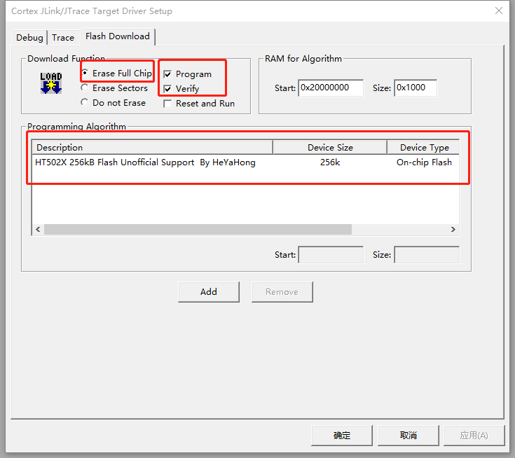
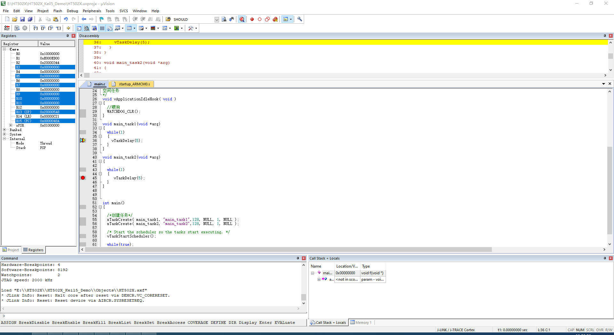

# 注意

本工程并非官方支持,仅供测试。

# 说明

这是一个在Keil5下编译HT502X程序的编程Demo。

- 程序开发方式为寄存器编程，即直接访问寄存器。寄存器需要根据数据手册自行定义。
- 数据手册请访问[doc](Doc)目录。

# 要求

- 必须先安装工程目录下的设备支持包(*.pack)。

- 配置好ARM开发环境

# 调试

- 由于看门狗问题,推荐在TEST=0且JTAGWDTEN （PA6）=0时调试。
- 由于HT5027比较坑的Flash读保护机制,若编程后Flash的0xFC1地址不为0xFF，将有可能校验失败。导致调试失败。
- 推荐每次写Flash前都是用芯片擦除而不是扇区擦除。

## 编程算法设置

## 调试结果

